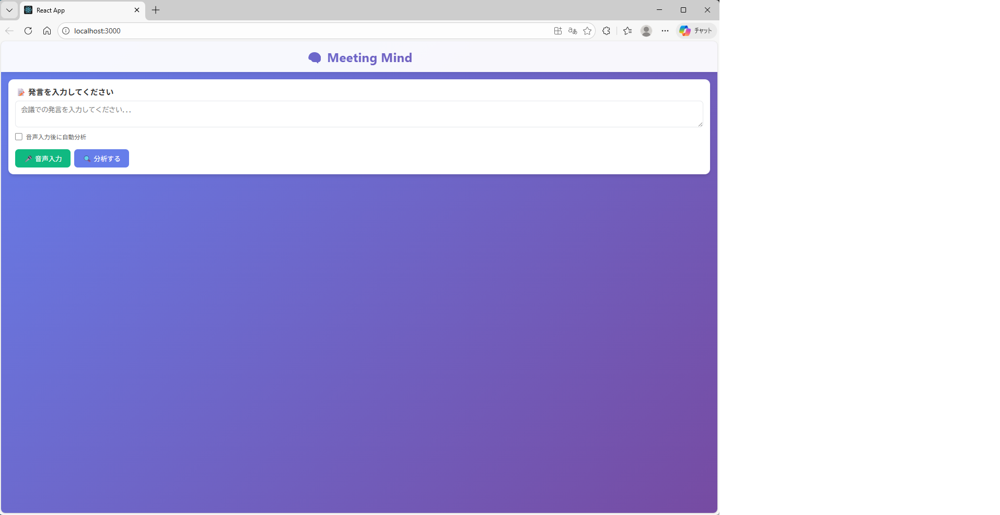
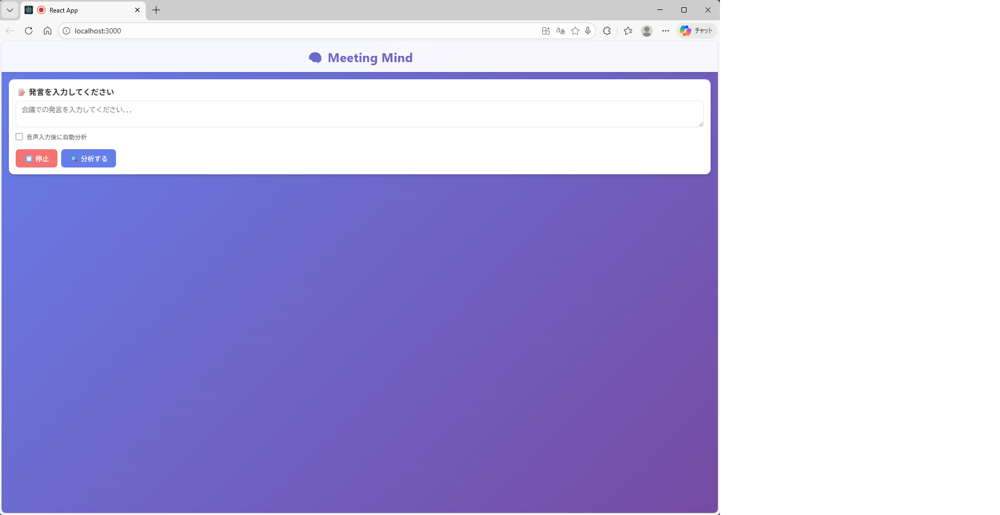
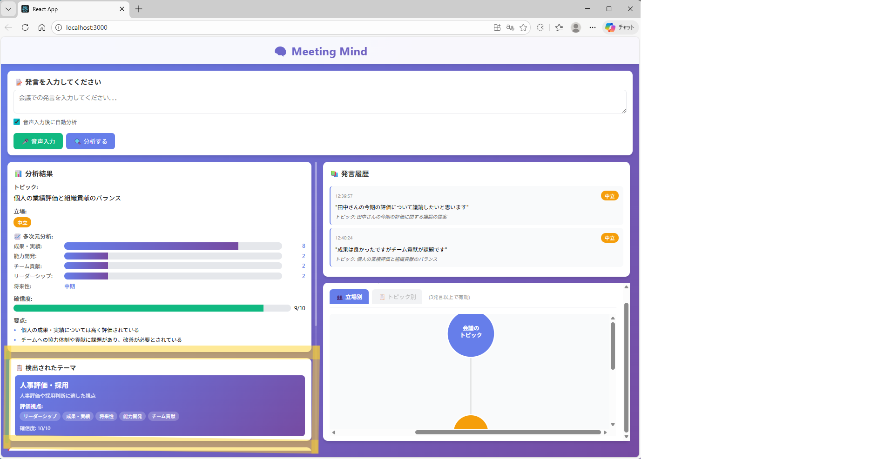
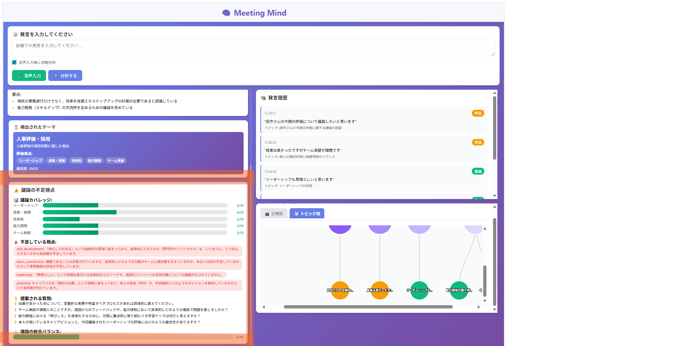
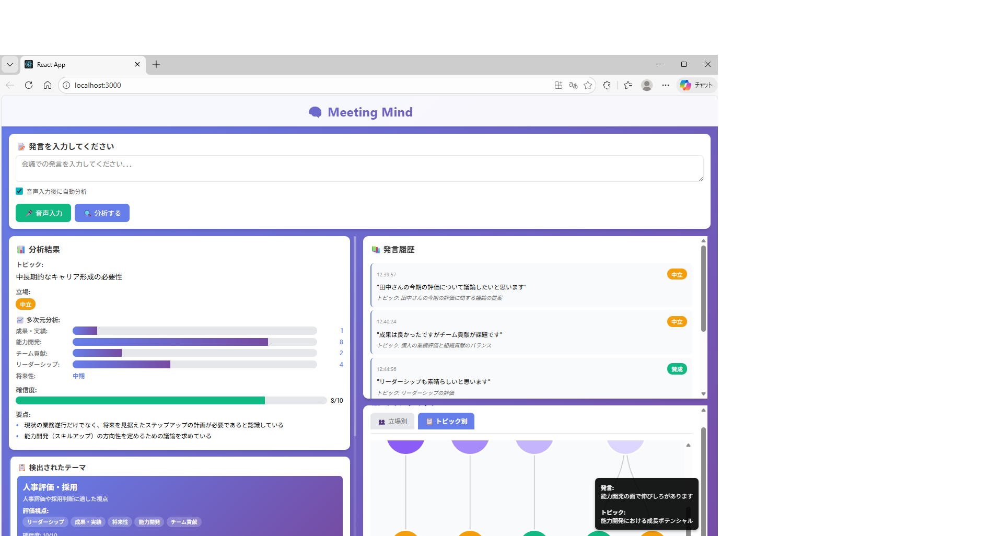
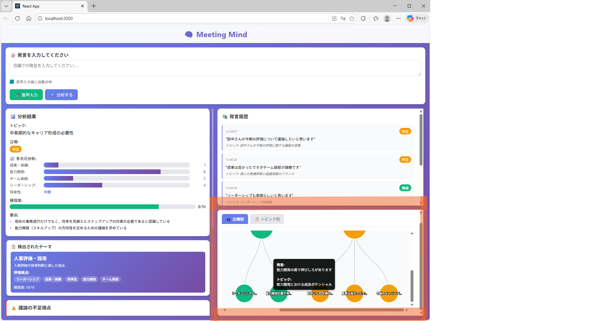
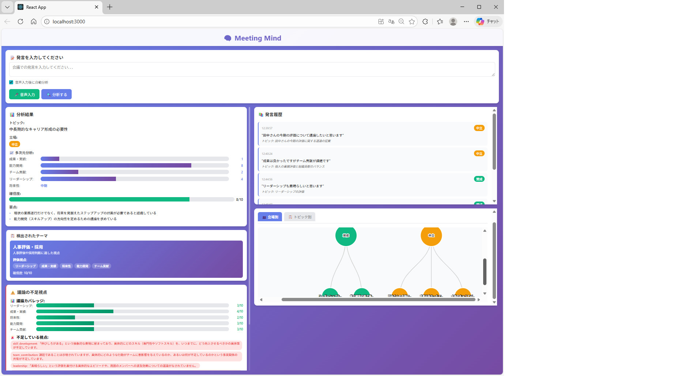

# 🧠 Meeting Mind

AI-powered meeting facilitator using Gemini 3 Flash

[](https://github.com/forthvalleyst/meeting-mind)

## 📋 Overview

Meeting Mind は、会議の議論を AI が自動分析し、不足している視点を指摘する次世代ファシリテーションツールです。

### 🎯 解決する課題

日本企業の意思決定会議には、組織文化に起因する構造的な問題があります:

- **反対意見が出ない会議**: 「異論なし」で進む形骸化した意思決定
- **同調圧力の文化**: 反対意見を言いにくい雰囲気
- **声の大きい人への偏り**: 特定の人物の意見に議論が偏る
- **重要な視点の欠落**: リスクや代替案が検討されないまま決定

これらは単なる会議運営の問題ではなく、**組織の多様性を阻害し、イノベーションを妨げる文化的課題**です。

### 💡 Meeting Mind のアプローチ

AI が客観的に「不足している視点」を指摘することで:

- ✅ **反対意見を代弁**: システムが反対の視点を提示することで、個人が言いにくい意見を可視化
- ✅ **心理的安全性の向上**: AI の指摘なら受け入れやすい
- ✅ **会議の活性化**: 多角的な議論を促進
- ✅ **組織文化の変革**: 多様な意見を受け入れる組織へ

Meeting Mind は単なる議事録ツールではなく、**組織の意思決定文化を変革する触媒**を目指します。

### 🌟 なぜ Meeting Mind なのか?

従来の会議支援ツールは「記録」や「要約」に焦点を当てていますが、Meeting Mind は**会議を変えることを通じて組織文化を変える**ことを目指します。

AI が中立的な立場から「この視点が不足しています」と指摘することで:
- 人間関係を壊さずに反対意見を提示できる
- 役職や立場に関係なく、議論の偏りを是正できる
- 「言いにくいこと」を AI が代弁する

これにより、**多様性を受け入れ、活発な議論ができる組織文化**への変革を支援します。

## ✨ Features

### 🎤 音声入力対応
ハンズフリーで会議の発言を記録。Web Speech API により日本語の音声認識を実装。

### 🤖 会議テーマ自動検出
Gemini 3 Flash が発言内容から会議のテーマを自動判定。以下の6種類に対応:
- 設備投資・設備導入
- 人事評価・採用
- 新製品開発
- 予算策定・コスト削減
- 業務改善・プロセス改革
- その他 (汎用)

### 📊 動的多次元分析
検出されたテーマに応じて、適切な評価軸で発言を自動分析。
- 人事評価の場合: 成果・実績、能力開発、チーム貢献、リーダーシップ、将来性
- 設備投資の場合: コスト重視度、安全性重視度、効率性重視度、人材育成重視度、時間軸

### 🏷️ トピック自動分類
AI が発言を意味的にグループ化し、3-5個の主要トピックに自動分類。

### ⚠️ 不足視点の検出
議論が偏っている視点をリアルタイムで指摘し、具体的な質問を提案。

### 🗺️ マインドマップ可視化
D3.js を使った2種類のビュー:
- **立場別ビュー**: 賛成/反対/中立で発言を分類
- **トピック別ビュー**: AI が意味的にグループ化した発言を表示

## 🛠️ Tech Stack

### Frontend
- React 18
- D3.js (マインドマップ可視化)
- Web Speech API (音声入力)

### Backend
- Flask (Python 3.13)
- Gemini 3 Flash API
  - 会議テーマ検出
  - 多次元分析
  - トピック自動分類
  - 不足視点検出

### Deployment
- Cloud Run (予定)

## 🚀 Getting Started

### Prerequisites

**バックエンド:**
```bash
Python 3.13+
Gemini API Key
```

**フロントエンド:**
```bash
Node.js 16+
npm
```

### Installation

1. リポジトリをクローン
```bash
git clone https://github.com/forthvalleyst/meeting-mind.git
cd meeting-mind
```

2. バックエンドのセットアップ
```bash
cd backend
pip install -r requirements.txt --break-system-packages

# .env ファイルを作成
echo "GEMINI_API_KEY=your_api_key_here" > .env
```

3. フロントエンドのセットアップ
```bash
cd ../frontend
npm install
```

### Running the Application

**ターミナル1 (バックエンド):**
```bash
cd backend
python main.py
# http://localhost:8080 で起動
```

**ターミナル2 (フロントエンド):**
```bash
cd frontend
npm start
# http://localhost:3000 で起動
```

ブラウザで `http://localhost:3000` を開いてください。

## 📖 Usage

1. **発言を入力**: テキスト入力または音声入力 (🎤 音声入力ボタン)
2. **自動分析**: 🔍 分析するボタンをクリック、または自動分析モードを有効化
3. **テーマ検出**: 2発言目以降、会議テーマが自動検出される
4. **結果確認**: 
   - 多次元分析結果
   - 不足している視点の指摘
   - 具体的な質問提案
5. **マインドマップ**: 
   - 👥 立場別タブ: 賛成/反対で分類
   - 📋 トピック別タブ: AI が意味でグループ化 (3発言以上)

## 🎯 Architecture
```
┌─────────────┐
│   Browser   │
│  (React)    │
└──────┬──────┘
       │ REST API
┌──────▼──────┐
│   Flask     │
│  (Backend)  │
└──────┬──────┘
       │ API Call
┌──────▼──────┐
│   Gemini    │
│  3 Flash    │
└─────────────┘
```

## 📸 Screenshots

### 初期画面


### 音声入力中


### テーマ検出と多次元分析


### 不足視点の検出


### マインドマップ - トピック別ビュー


### マインドマップ - 立場別ビュー


### 全体俯瞰



## 🎬 Demo

(デモ動画追加予定)

## 🏆 Hackathon

このプロジェクトは [Google Cloud Agentic AI Hackathon 2026](https://events.withgoogle.com/google-cloud-agentic-ai-hackathon/) に提出予定です。

## 📝 License

MIT

## 👤 Author

- GitHub: [@forthvalleyst](https://github.com/forthvalleyst)

## 🙏 Acknowledgments

- Google Gemini API
- Google Cloud AI Hackathon
- D3.js Community